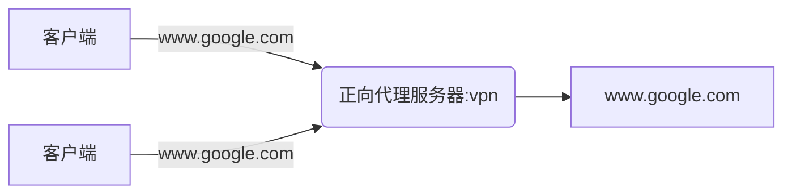
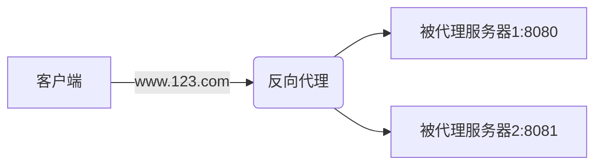
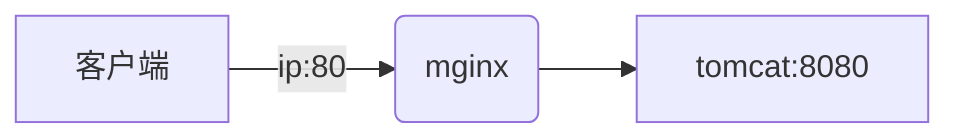
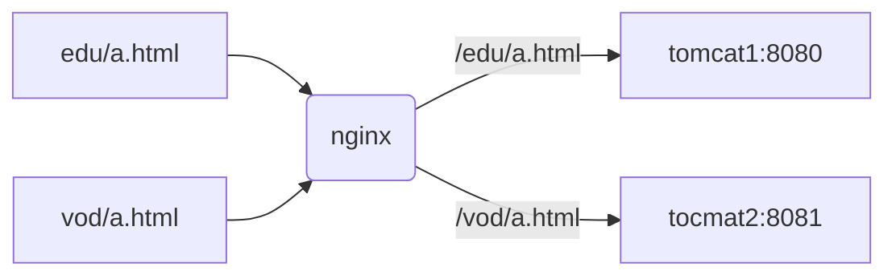
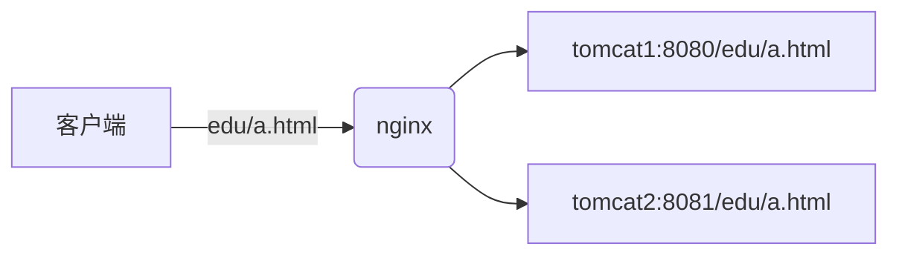

## Nginx

Nginx功能：反向代理、负载均衡、动静分离、高可用

### 结构


### 环境准备

1. 安装nginx

2. 安装jdk

3. 安装tomcat、启动tomcat(`./bin/startup.sh`)

4. 防火墙

   启动：`systemctl start firewall`

   开机自启：`systemctl enable firewalld.service`

5. 对外开放tomcat端口（默认8080）

   `firewall-cmd --add-port 8080/tcp --permanent`

   `firewall-cmd --reload`

   `firewall-cmd --list-all`

6. 添加安全组

7. 修改本地hosts文件

   ip域名映射配置：在`C:\Windows\System32\drivers\etc\hosts`文件末尾添加`ip 域名`如`115.28.184.149 www.htc.com`

#### 安装nginx

1. pcre、pcre-devel安装

   `yum install -y pcre pcre-devel`

2. 下载nginx到usr/src

   `wget http://nginx.org/download/nginx-1.9.9.tar.gz  `

3. 解压ngnix

   `tar -zxvf  nginx-1.9.9.tar.gz`

4. 安装

   `./configure`

   `make && make install`

5. 配置nginx.conf

   - 切换到`/usr/local/nginx/conf`

   - `vi nginx.conf`

6. 启动nginx服务

   - 切换到`/usr/local/nginx/sbin`

   - `./nginx`


### 反向代理

#### 正向代理

​	基于客户端的代理，将多个用户的访问转发到某一个被代理网站。如：VPN等，（客户知道它最终要做什么，中间过程由代理完成）




#### 反向代理

​	基于服务端的代理，将一个用户的访问转发到服务内的某一IP地址，这个IP将访问转发到某一个服务器。（服务端知道客户要做什么，但最终执行由服务端决定）




**实战1**：客户端访问服务器80端口时被代理到tomcat的8080端口



**实现**：

1. 修改nginx配置文件s

   - 在端口为80的server块添加server_name的localhost为ip地址，也可以不用改
   - 在server块 -> location / 中添加`proxy_pass http://127.0.0.1:8080`

2. 重新加载nginx

   `./sbin/nginx -s reload`

> 配置成功后可以不对外开启8080端口。

**实战2**：客户端访问80端口下的edu/a.html资源是转发到8080端口的tomcat，访问vod/a.html时转发到8081端口的tomcat。如http://115.28.184.149/edu/a.html会访问到tomcat1:8080的资源文件；http://115.28.184.149/vod/a.html则是tomcat2:8081资源。




**实现：**

1. 安装第一个tomcat1，端口为8080；安装第2个tomcat2，修改conf/server.xml文件中的port端口(全都加1)

2. 开启8081端口、添加安全组

3. 在tomcat1的webapp下新建`edu/a.html`，在tomcat2的webapp下新建`vod/a.html`，通过8080和8081访问测试是否配置成功

4. 修改nginx.conf，在80端口下配置edu和8080的映射

   ```nginx
   location ~ /edu/{
   	proxy_pass http://127.0.0.1:8081;
   }
   
   location ~ /vod/ {
       proxy_pass http://127.0.0.1:8081;
   }
   ```

5. 重新加载nginx，分别访问http://ip/edu/a.html和http://ip/vod/a/html会访问到不同tomcat。


### 负载均衡

>  概念：通过均衡算法策略，将请求分配到不同的服务。

​	将访问

**实战1**：客户端访问http://ip:8888/edu/a.html时，平均分配到tomcat1和tomcat2的资源。



实现：

1. 在tomcat1和tomcat2下都创建edu/a.html资源
2. 配置nginx并重新加载

```nginx
http{
    
    //添加均衡服务器
    upstream myServer{
        server 127.0.0.1:8080;
        server 127.0.0.1:8081;
    }
    
    server{
        listen 8888;
        server_name localhost;
        location / {
            proxy_pass http://myServer;//对应上面upstream的servers
        }
    }
}
```

3. 多次访问http://ip:8888/edu/a.html，观察效果


#### 5种均衡算法

1. 轮询(默认)：每个请求按时间顺序分配到不同的服务器。

2. 权重：权重大的服务器优先分配。

   ```nginx
   http{
       upstream myServer{
           server 127.0.0.1:8080 weight=10; #优先分配
           server 127.0.0.1:8080 weight=2;
       }
   }
   ```

3. ip_hash：计算客户端的ip哈希，可以解决session不能共享的一些问题，（*注意宕机问题*）。

```nginx
http{
    upstream myServer{
    	ip_hash;#同一个ip每次固定访问一个服务器,若服务宕机则自动剔除
        server 127.0.0.1:8080;
        server 127.0.0.1:8080;
    }
}
```

- 优点：简单，成本低廉。

- 缺点：可靠性低，负载分配不均衡。

4. fair（第三方）：响应时间短的服务器优先分配。

5. url_hash（第三方）：对url进行hash再决策使用哪个服务器，常用于缓存。

### 动静分离

​	将静态文件如html、css、js等放在某个目录下，而jsp等放在另外目录。由于静态文件内容不常改变，可在客户端作缓存处理，当静态文件内容不变时，返回304，当内容发生改变时也会及时更新到客户端并返回200。

### 高可用
配置多个nginx，当主nginx宕机时启用备用nginx（主从/主备模式）

#### keepalive


### 一致性hash

#### 缓存雪崩

#### 虚拟节点


